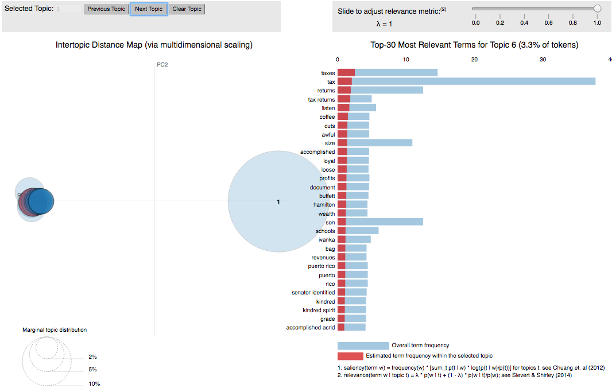

# Data-mining-using-NLP

In this project we are looking for a possible use of the new york times articles as training data for Natural Language Processing projects.

We wrote New York Times scraper which uses BeautifulSoup to scrape the article pages. `scripts/webscrapers/nytscraper.py` works with python 2.7 and the other one guess.

We also wrote an alternative scraper `nytsnippetgetter.py` that does not parse the actual html pages to get the information. The difference is that instead of full article body we get just the `snippet`, `lead_paragraph` and `asbtract`. The advantage is that we obtain data even about articles that are available for subscribers only. Additionally, it is much quicker. We were able to download 20 thousand files in around 15 minutes.

# Code and Results

To see the code and see how to do the nitty visualization of the LDA model topics check out [simple-intro.ipynb](http://nbviewer.jupyter.org/github/KobaKhit/Data-mining-using-NLP/blob/0a09bd8ddd7bb415d7275caedb92ff7eb7f8c4fe/draft/simple-intro.ipynb#topic=0&lambda=1&term=)

## Feature Extraction Using Topic  Modelling

**A real world example where such thing would be useful in 7 steps**

> Imagine we have a library of books without titles in a digital form. How can we classify them? 

  1. Compute the TFxIDF matrix
  2. Obtain topic term distribution estimates using LDA or NMF
  3. Choose topics you consider meaningful
  4. Train a classifier on the  topic-term distribution estimates
  5. Classify data
  6. ???
  7. Profit

In this sections we explore the possibility of classifying documents using the topic-term distribution estimates generated by the LDA and NMF.

We fit the LDA model on the original TFxIDF  and get the topic-term distribution. Then, when we have new documents coming in
we obtain the TFxIDF matrix for the new cospus and get the topic-term distribution using the LDA model trained on the existing corpus. We do the same for NMF. 

For classification we tried Multinomial Naive Bayes and ExtraTreesClassifier. Below you can see results. In general the bigger the number of topics for the LDA model the better the classification accuracy. We went with 20. For NMF model 10 topics was enough to produce features that give us accuracy almost as good as when using the TFxIDF matrix.

| Features / Classifier   	| LDA    	| NMA    	| TFxIDF 	|
|-------------------------	|--------	|--------	|--------	|
| Multinomial Naive Bayes 	| 0.559  	| 0.3039 	| 0.7817 	|
| ExtraTreesClassifier    	| 0.7458 	| 0.8723 	| 0.8885 	|

### LDA

# To do's
  - [] -  Use features from LDA and NMF in a one classifier
  - [x] - Do visuals
  - [x] - Do a test example.

